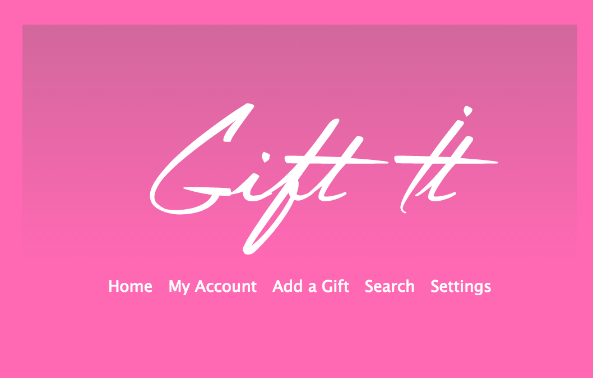
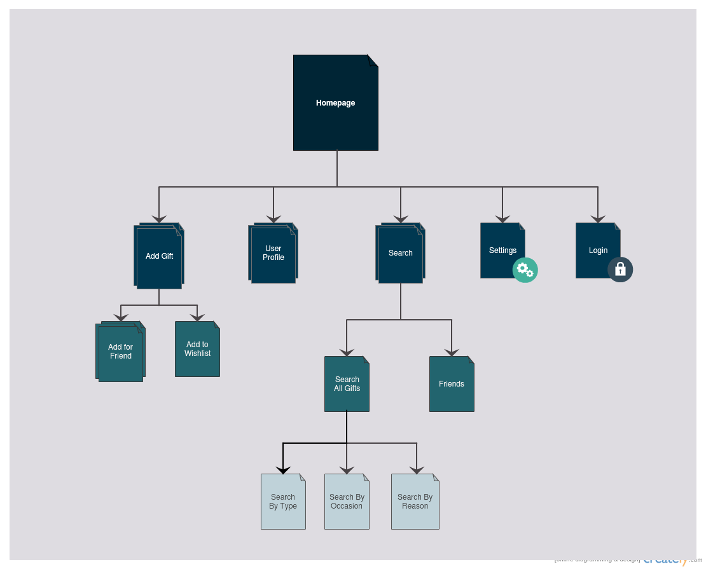

# Gift It

## Overview

Gift It is a web application where users can store gift ideas under certain categories (celebration, occasion, friend). When the occasion arrives or is nearing, Gift It will send an email to the user to remind the user of the gift idea.

## Data Model

Gift It will use MongoDB (NoSQL, document-store) as its database.

Gift It will need to store Users, Gifts, Events and Tags (descriptives for gifts/events).

* Users will store Gifts and Events. 

First draft schema:

```javascript
// User
// * our site requires authentication so users have a username and password
var User = new mongoose.Schema({
	// username, password provided by plugin
  first_name: String,
	last_name: String,
	email: String,
  birthday: Date,
	friends: [User],
	wishlist: [Gift],
  giftlist: [Gift],
  eventlist: [Event]
});

// Gift
var Gift = new mongoose.Schema({
	gift_name: String,
  owner: User,
  price: Number,
  tags: [Tag],
  is_private: Boolean
});

// Event
var Event = new mongoose.Schema({
  name: String,
  owner: User,
  date: Date,
  tags: [Tag],
  is_private: Boolean,
  giftlist: [Gift]
});

// Tag
var Tag = new mongoose.Schema({
  name: String,
  is_private: Boolean,
  type: String
});

```

## Wireframes



## User Stories

* As a student/worker, I want a gift idea logger to record down gift ideas when they come to mind, as I am often busy and forget about them after minutes.
* As a person who enjoys shopping, I want an open environment where I can not only list down gifts I believe my friends will enjoy, but also a place to record gifts for myself in a wishlist.

## Sitemap



## Topics

* Authentication (3 pts) ✓
* Pre-built Express templates (1 pts) ✓
* CSS Preprocessor - SASS (1 pts) ✓
* Server-side JS Module - NodeMailer (1 pts) ✓
* Server-side JS Module - Node-Schedule (1 pts) ✓
* Ebay API (2 pts) ✓

## Modules

* <b>Passport:</b><br>
	<b>Description:</b> User authentication<br>
	<b>Need:</b> Login users to website

* <b>Mongoose:</b><br>
	<b>Description:</b> Module to connect to MongoDB<br>
	<b>Need:</b> Interact with the MongoDB database

Other Add-ons:

* <b>NodeMailer</b> (https://github.com/andris9/Nodemailer)<br>
	<b>Description:</b> NodeMailer is an email module that allows you to send emails through a Node.js application.<br>
	<b>Need:</b> I will need NodeMailer to send reminder emails to users.
